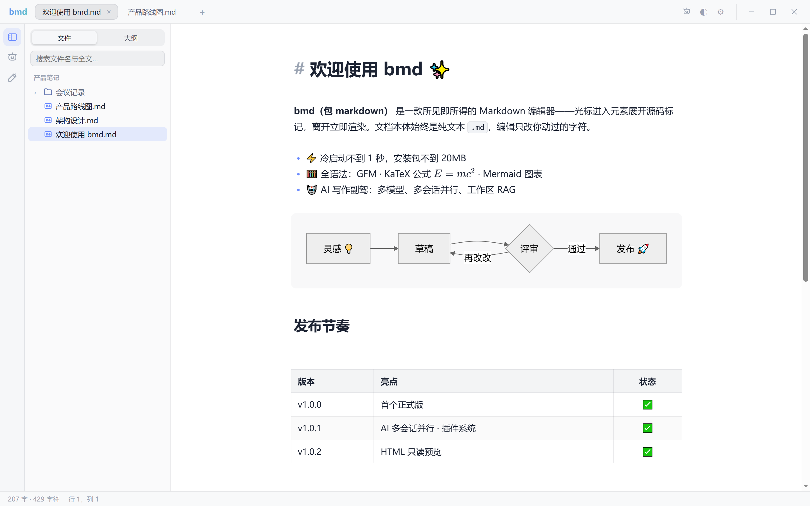
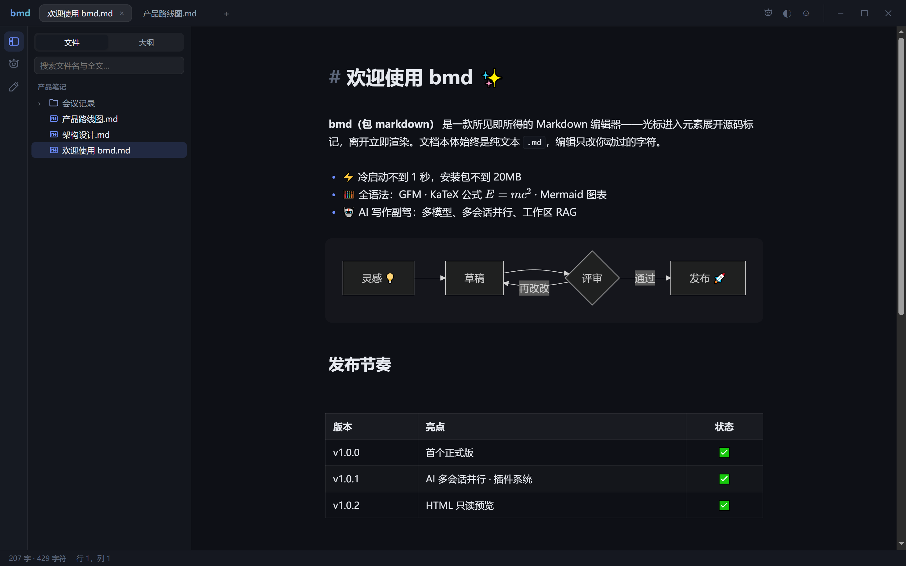

<div align="center">


# bmd · Bao Markdown

**所见即所得的 Markdown 编辑器 —— 极快启动 · 即时渲染 · AI 写作副驾**

[](https://github.com/aixlb/bmd/releases/latest)
[](https://github.com/aixlb/bmd/actions)
[](LICENSE)


[功能特性](#功能特性) · [下载安装](#下载安装) · [用户手册](MANUAL.md) · [插件开发](PLUGINS.md) · [更新日志](CHANGELOG.md)

</div>



<details>
<summary>🌙 看看暗色主题</summary>



</details>

## 功能特性

### ✍️ 即时渲染编辑

- **reveal-on-cursor**：光标进入元素展开 Markdown 源码标记，离开立即渲染回排版效果——不是左右分屏，也不是黑盒富文本（自研 CodeMirror 6 内核，IME 安全、视口虚拟化）
- **零污染**：文档本体始终是纯文本 `.md`，编辑只改你动过的字符，绝不整篇重排
- **GFM 全套**：表格（单元格就地编辑、`Tab` 跳格）、任务列表、删除线、代码块语法高亮
- **KaTeX 公式**：`$...$` 行内、`$$...$$` 块级
- **Mermaid 图表**：代码块实时出图，随主题明暗重渲染
- **高效输入**：行首 `/` 唤出 Slash 插入菜单 · 选中浮现浮动工具条 · `⌘B` `⌘I` `⌘E` `⌘K` 格式快捷键 · `⌘/` 整篇源码模式
- **图片粘贴**：截图直接粘贴，自动存入文档同级 `assets/` 并写入相对路径

### 🗂 工作区

- 文件树（右键新建/重命名/删除）· 文档大纲 · 多标签（右键批量关闭、溢出翻阅按钮）
- **全文搜索**同时匹配文件名与内容，`⌘P` 快速打开任意文件
- 自动保存 · 会话恢复（重启回到上次的标签与位置）· 外部变更监听
- **HTML 只读预览**：`.html` 点击即预览，相对路径的图片/CSS/JS 正常加载，外部修改自动刷新

### 🤖 AI 写作副驾

- **多模型可配置**：Claude / OpenAI / DeepSeek / Kimi / MiniMax / 通义千问 / 智谱 GLM / Ollama 本地，或任意 OpenAI 兼容端点
- **多会话并行**：会话标签栏 ＋ 新建、点击切换，多个会话同时提问互不阻塞
- **上下文随手控**：选区 / @文件 / 工作区 RAG 检索（AI 引用相关笔记作答）
- **改动先看后落盘**：插入或替换前弹 diff 预览，确认才写入
- **快捷操作**：续写 / 润色 / 翻译 / 总结 / 生成大纲一键套用
- API Key 存系统钥匙串（macOS 钥匙串 / Windows 凭据管理器），**无遥测**

### 📤 导出

- **HTML**：单文件内嵌样式，随主题明暗
- **PDF**：原生静默分页导出、无打印对话框——macOS 走 WKWebView 打印管线，Windows 走 WebView2 `PrintToPdf`，相对路径图片正确嵌入

### 🔌 插件系统

- 把插件文件夹放进 `{appData}/plugins/` 即用：活动栏图标、状态栏项、命令 + 全局热键、设置页四类贡献点，宿主事件订阅与数据持久化
- 严格 CSP（无 `unsafe-eval`），插件经 Blob ESM 装载
- 上手看 [PLUGINS.md](PLUGINS.md) 与示例插件 [examples/plugins/hello-world](examples/plugins/hello-world)

### 🔒 隐私

- 无遥测、无统计上报；除你配置的 AI 端点外零网络请求
- 数据全在本地：文档是磁盘上的纯文本，RAG 索引存本地 SQLite，卸载不留尾巴

## 下载安装

前往 **[GitHub Releases](https://github.com/aixlb/bmd/releases/latest)** 下载对应平台的包：

| 平台 | 包 | 说明 |
|---|---|---|
| Windows 10/11 | `bmd_x.y.z_x64-setup.exe` | NSIS 安装包，自动配置 WebView2，注册 `.md` 关联 |
| Windows 绿色便携版 | `bmd_x.y.z_x64-portable.zip` | 解压即用、免安装 |
| macOS（Apple Silicon） | `bmd_x.y.z_aarch64.dmg` | 需 macOS 11+ |
| macOS（Intel） | `bmd_x.y.z_x64.dmg` | 需 macOS 11+ |

安装后想让 `.md` 默认用 bmd 打开？见手册 [「安装」一节](MANUAL.md#1-安装) 的各系统设置步骤。

## 常用快捷键

| 功能 | Windows | macOS |
|---|---|---|
| 新建 / 打开 / 打开文件夹 | `Ctrl+N` / `Ctrl+O` / `Ctrl+Shift+O` | `⌘N` / `⌘O` / `⌘⇧O` |
| 保存 / 快速打开 / 查找替换 | `Ctrl+S` / `Ctrl+P` / `Ctrl+F` | `⌘S` / `⌘P` / `⌘F` |
| 加粗 · 斜体 · 行内代码 · 链接 | `Ctrl+B` `I` `E` `K` | `⌘B` `I` `E` `K` |
| 标题 1–6 级 / 回正文 | `Ctrl+Alt+1…6` / `Ctrl+Alt+0` | `⌘⌥1…6` / `⌘⌥0` |
| 代码块 · 引用 · 公式块 · 表格 | `Ctrl+Shift+K` `Q` `M` `T` | `⌘⇧K` `Q` `M` `T` |
| 标签切换 / 直达 | `Ctrl+Tab` / `Ctrl+1–9` | `Ctrl+Tab` / `⌘1–9` |
| 源码模式 / AI 面板 / 明暗主题 | `Ctrl+/` / `Ctrl+J` / `Ctrl+Shift+L` | `⌘/` / `⌘J` / `⌘⇧L` |

> 完整列表见 [用户手册 · 快捷键总表](MANUAL.md#8-快捷键总表)。

## 技术栈与开发

Tauri 2 · Rust · Vue 3 + TypeScript + Vite · CodeMirror 6 / Lezer（自研 live-preview 内核 `bmd-core`）· KaTeX · Mermaid

```bash
npm install && npm run tauri dev    # 桌面开发
npm run dev                         # 纯网页预览（5173）
npx vitest run && cargo test --manifest-path src-tauri/Cargo.toml   # 测试
npm run tauri build                 # 本地打包；推 v* tag 触发 CI 全平台发布
```

## License

[MIT](LICENSE) © 2026 玩AI的小笼包 · 有需求猛敲我 [@玩AI的小笼包](https://xhslink.com/m/vX0zH462eU)
